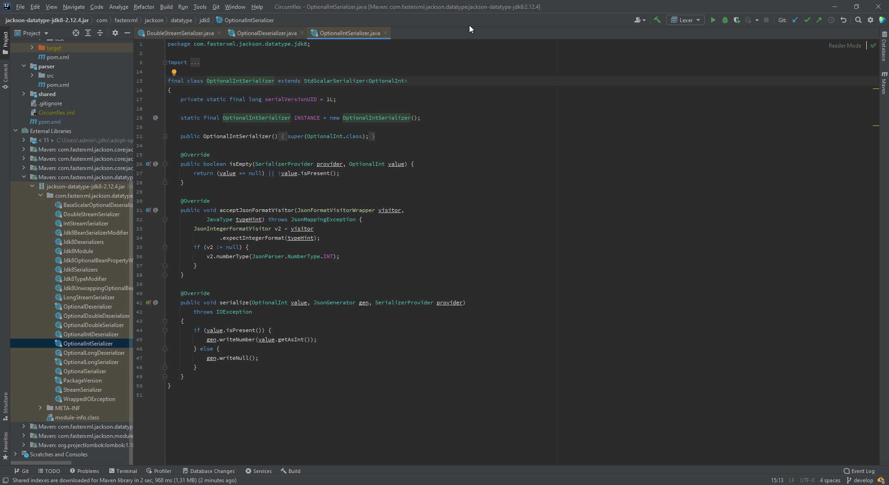
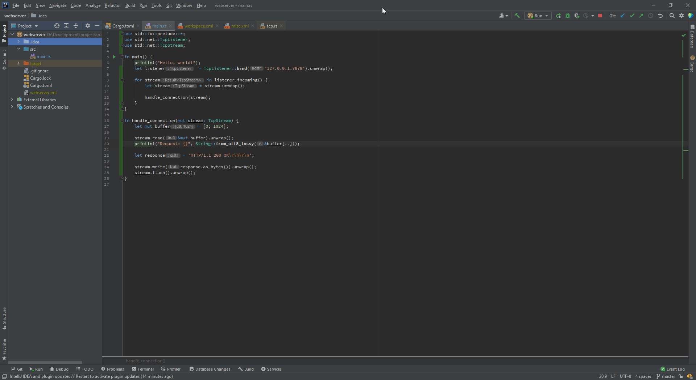

# Visual Studio 2013 - Dark Color Scheme

## Information
This is a Visual Studio style color scheme.
I personally use it for Java and Rust development.

You can get it from the [Jetbrains Plugin Marketplace](https://plugins.jetbrains.com/plugin/17219-visual-studio-2013--dark-color-scheme).

## Screenshots

